# Document 03: Architecture Diagrams

## Diagram 01: System Context Diagram

Green: existing (MVP). Amber: planned. Grey dashed: future integration.

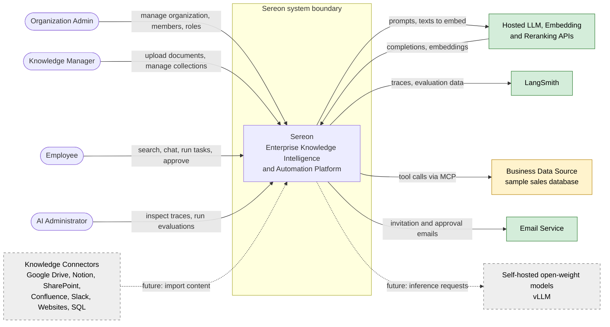
```mermaid
flowchart LR
  OA([Organization Admin])
  KM([Knowledge Manager])
  EMP([Employee])
  AIA([AI Administrator])

  subgraph BOUNDARY["Sereon system boundary"]
    SYS["Sereon<br/>Enterprise Knowledge Intelligence<br/>and Automation Platform"]
  end

  LLM["Hosted LLM, Embedding<br/>and Reranking APIs"]
  LS["LangSmith"]
  BIZ["Business Data Source<br/>sample sales database"]
  MAIL["Email Service"]
  SRC["Knowledge Connectors<br/>Google Drive, Notion, SharePoint,<br/>Confluence, Slack, Websites, SQL"]
  VLLM["Self-hosted open-weight models<br/>vLLM"]

  OA -->|"manage organization, members, roles"| SYS
  KM -->|"upload documents, manage collections"| SYS
  EMP -->|"search, chat, run tasks, approve"| SYS
  AIA -->|"inspect traces, run evaluations"| SYS

  SYS -->|"prompts, texts to embed"| LLM
  LLM -->|"completions, embeddings"| SYS
  SYS -->|"traces, evaluation data"| LS
  SYS -->|"tool calls via MCP"| BIZ
  SYS -->|"invitation and approval emails"| MAIL
  SRC -.->|"future: import content"| SYS
  SYS -.->|"future: inference requests"| VLLM

  classDef existing fill:#d4edda,stroke:#2e7d32,color:#000
  classDef planned fill:#fff3cd,stroke:#b8860b,color:#000
  classDef future fill:#eeeeee,stroke:#777,stroke-dasharray:5 5,color:#000
  class LLM,LS,MAIL existing
  class BIZ planned
  class SRC,VLLM future
```

## Diagram 02: High-Level System Architecture Diagram

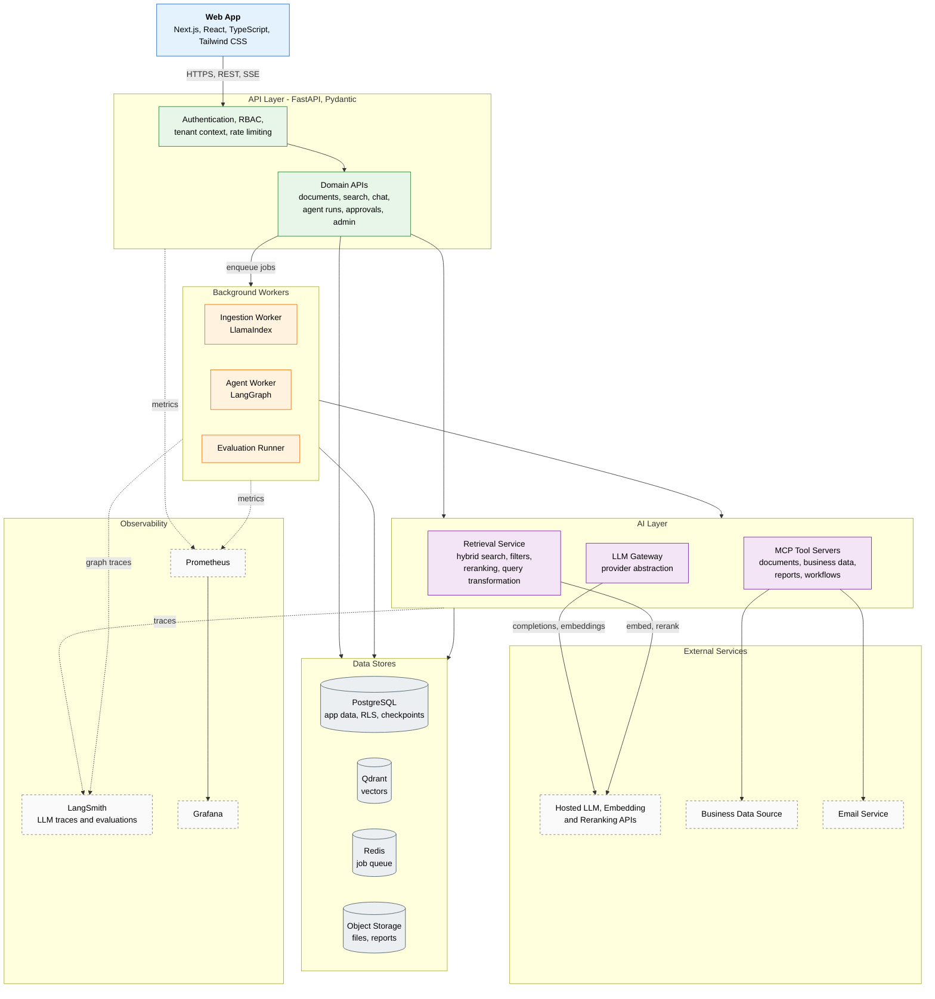
```mermaid
flowchart TB
  WEB["<b>Web App</b><br/>Next.js, React, TypeScript, Tailwind CSS"]

  subgraph API["API Layer - FastAPI, Pydantic"]
    GW["Authentication, RBAC,<br/>tenant context, rate limiting"]
    SVC["Domain APIs<br/>documents, search, chat,<br/>agent runs, approvals, admin"]
    GW --> SVC
  end

  subgraph WORK["Background Workers"]
    ING["Ingestion Worker<br/>LlamaIndex"]
    AGW["Agent Worker<br/>LangGraph"]
    EVW["Evaluation Runner"]
  end

  subgraph AI["AI Layer"]
    RET["Retrieval Service<br/>hybrid search, filters,<br/>reranking, query transformation"]
    LGW["LLM Gateway<br/>provider abstraction"]
    MCP["MCP Tool Servers<br/>documents, business data,<br/>reports, workflows"]
  end

  subgraph DATA["Data Stores"]
    PG[("PostgreSQL<br/>app data, RLS, checkpoints")]
    QD[("Qdrant<br/>vectors")]
    RD[("Redis<br/>job queue")]
    OBJ[("Object Storage<br/>files, reports")]
  end

  subgraph EXT["External Services"]
    MODELS["Hosted LLM, Embedding<br/>and Reranking APIs"]
    BIZ["Business Data Source"]
    MAIL["Email Service"]
  end

  subgraph OBS["Observability"]
    LS["LangSmith<br/>LLM traces and evaluations"]
    PROM["Prometheus"]
    GRA["Grafana"]
    PROM --> GRA
  end

  WEB -->|"HTTPS, REST, SSE"| GW
  SVC -->|"enqueue jobs"| WORK
  SVC --> AI
  WORK --> AI
  SVC --> DATA
  WORK --> DATA
  AI --> DATA
  LGW -->|"completions, embeddings"| MODELS
  RET -->|"embed, rerank"| MODELS
  MCP --> BIZ
  MCP --> MAIL
  AI -.->|"traces"| LS
  WORK -.->|"graph traces"| LS
  API -.->|"metrics"| PROM
  WORK -.->|"metrics"| PROM

  classDef client fill:#e3f2fd,stroke:#1565c0,color:#000
  classDef api fill:#e8f5e9,stroke:#2e7d32,color:#000
  classDef work fill:#fff3e0,stroke:#ef6c00,color:#000
  classDef ai fill:#f3e5f5,stroke:#7b1fa2,color:#000
  classDef data fill:#eceff1,stroke:#455a64,color:#000
  classDef ext fill:#fafafa,stroke:#777,stroke-dasharray:4 4,color:#000
  class WEB client
  class GW,SVC api
  class ING,AGW,EVW work
  class RET,LGW,MCP ai
  class PG,QD,RD,OBJ data
  class MODELS,BIZ,MAIL,LS,PROM,GRA ext
```

### Architecture decisions and trade-offs

1. **Tenant isolation in three layers.** Every query passes through one data-access layer that injects `organization_id`. PostgreSQL Row-Level Security is a second barrier against application bugs. Every Qdrant query carries a mandatory organization filter. A shared Qdrant collection with a tenant filter scales cheaply but depends on that filter, so automated cross-tenant tests are required.
2. **Permission-aware retrieval without re-embedding.** Vector payloads hold only organization, collection, and document identifiers. Retrieval filters by permitted collections, and document-level overrides are checked in PostgreSQL afterward. Permission changes never require re-indexing. The cost is a post-filter step that may need to over-fetch.
3. **Asynchronous ingestion.** The API returns immediately after storing the file and queueing a job. Steps are idempotent, and statuses are explicit (queued, processing, ready, failed), so storage, PostgreSQL, and Qdrant can be brought back to a consistent state.
4. **Deterministic-first agents.** LangGraph uses fixed nodes and conditional edges. The LLM plans only where the task is open-ended. Checkpoints in PostgreSQL let approval waits survive worker restarts.
5. **LLM Gateway.** One interface wraps the model provider so hosted models can later be replaced by vLLM without changing business logic.
6. **Authorization stays in code.** MCP tool servers check identity, role, organization, and input in application code. Retrieved text is data and never instructions.
7. **Two observability systems.** LangSmith covers LLM traces and evaluation. Prometheus and Grafana cover API, worker, and infrastructure health.

## Diagram 03: Database ER Diagram

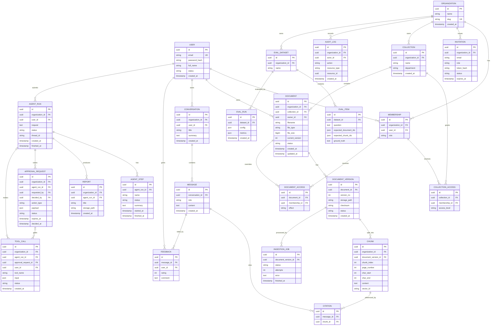
```mermaid
erDiagram
  ORGANIZATION ||--o{ MEMBERSHIP : has
  USER ||--o{ MEMBERSHIP : joins
  ORGANIZATION ||--o{ INVITATION : issues
  ORGANIZATION ||--o{ COLLECTION : owns
  COLLECTION ||--o{ COLLECTION_ACCESS : grants
  MEMBERSHIP ||--o{ COLLECTION_ACCESS : receives
  COLLECTION ||--o{ DOCUMENT : contains
  USER ||--o{ DOCUMENT : owns
  DOCUMENT ||--o{ DOCUMENT_VERSION : has
  DOCUMENT ||--o{ DOCUMENT_ACCESS : overrides
  MEMBERSHIP ||--o{ DOCUMENT_ACCESS : receives
  DOCUMENT_VERSION ||--o{ CHUNK : split_into
  DOCUMENT_VERSION ||--o{ INGESTION_JOB : processed_by
  USER ||--o{ CONVERSATION : starts
  CONVERSATION ||--o{ MESSAGE : contains
  MESSAGE ||--o{ CITATION : cites
  CHUNK ||--o{ CITATION : referenced_by
  MESSAGE ||--o{ FEEDBACK : rated_by
  USER ||--o{ FEEDBACK : gives
  USER ||--o{ AGENT_RUN : submits
  AGENT_RUN ||--o{ AGENT_STEP : has
  AGENT_RUN ||--o{ REPORT : produces
  AGENT_RUN ||--o{ APPROVAL_REQUEST : raises
  AGENT_RUN |o--o{ TOOL_CALL : makes
  APPROVAL_REQUEST |o--o{ TOOL_CALL : gates
  ORGANIZATION ||--o{ AUDIT_LOG : records
  ORGANIZATION ||--o{ EVAL_DATASET : owns
  EVAL_DATASET ||--o{ EVAL_ITEM : contains
  EVAL_DATASET ||--o{ EVAL_RUN : evaluated_by

  ORGANIZATION {
    uuid id PK
    string name
    string slug UK
    timestamp created_at
  }
  USER {
    uuid id PK
    string email UK
    string password_hash
    string full_name
    string status
    timestamp created_at
  }
  MEMBERSHIP {
    uuid id PK
    uuid organization_id FK
    uuid user_id FK
    string role
  }
  INVITATION {
    uuid id PK
    uuid organization_id FK
    string email
    string role
    string token_hash
    string status
    timestamp expires_at
  }
  COLLECTION {
    uuid id PK
    uuid organization_id FK
    string name
    string department
    timestamp created_at
  }
  COLLECTION_ACCESS {
    uuid id PK
    uuid collection_id FK
    uuid membership_id FK
    string access_level
  }
  DOCUMENT {
    uuid id PK
    uuid organization_id FK
    uuid collection_id FK
    uuid owner_id FK
    string filename
    string file_type
    bigint file_size
    int current_version
    string status
    timestamp created_at
    timestamp updated_at
  }
  DOCUMENT_VERSION {
    uuid id PK
    uuid document_id FK
    int version_no
    string storage_path
    string checksum
    string status
    timestamp created_at
  }
  DOCUMENT_ACCESS {
    uuid id PK
    uuid document_id FK
    uuid membership_id FK
    string effect
  }
  CHUNK {
    uuid id PK
    uuid organization_id FK
    uuid document_version_id FK
    int chunk_index
    int page_number
    int char_start
    int char_end
    text content
    string vector_id
  }
  INGESTION_JOB {
    uuid id PK
    uuid document_version_id FK
    string status
    int attempts
    text error
    timestamp finished_at
  }
  CONVERSATION {
    uuid id PK
    uuid organization_id FK
    uuid user_id FK
    string title
    text summary
    timestamp created_at
  }
  MESSAGE {
    uuid id PK
    uuid conversation_id FK
    string role
    text content
    timestamp created_at
  }
  CITATION {
    uuid id PK
    uuid message_id FK
    uuid chunk_id FK
  }
  FEEDBACK {
    uuid id PK
    uuid message_id FK
    uuid user_id FK
    int rating
    text comment
  }
  AGENT_RUN {
    uuid id PK
    uuid organization_id FK
    uuid user_id FK
    text request
    string status
    string thread_id
    timestamp created_at
    timestamp finished_at
  }
  AGENT_STEP {
    uuid id PK
    uuid agent_run_id FK
    string name
    string status
    text summary
    timestamp started_at
    timestamp finished_at
  }
  REPORT {
    uuid id PK
    uuid organization_id FK
    uuid agent_run_id FK
    string title
    string storage_path
    timestamp created_at
  }
  APPROVAL_REQUEST {
    uuid id PK
    uuid organization_id FK
    uuid agent_run_id FK
    uuid requested_by FK
    uuid decided_by FK
    string action_type
    json payload
    string status
    timestamp expires_at
    timestamp decided_at
  }
  TOOL_CALL {
    uuid id PK
    uuid organization_id FK
    uuid agent_run_id FK
    uuid approval_request_id FK
    uuid user_id FK
    string tool_name
    json input
    string status
    timestamp created_at
  }
  AUDIT_LOG {
    uuid id PK
    uuid organization_id FK
    uuid actor_id FK
    string action
    string resource_type
    uuid resource_id
    timestamp created_at
  }
  EVAL_DATASET {
    uuid id PK
    uuid organization_id FK
    string name
  }
  EVAL_ITEM {
    uuid id PK
    uuid dataset_id FK
    text question
    json expected_document_ids
    json expected_chunk_ids
    text ground_truth
  }
  EVAL_RUN {
    uuid id PK
    uuid dataset_id FK
    json config
    json metrics
    timestamp created_at
  }
```

### Important constraints

- Every table carrying `organization_id` has a Row-Level Security policy, and `organization_id` is part of its main indexes.
- `MEMBERSHIP (organization_id, user_id)` and `COLLECTION (organization_id, name)` are unique.
- `DOCUMENT_VERSION (document_id, version_no)` is unique. Duplicate detection uses `checksum` within an organization.
- `COLLECTION_ACCESS (collection_id, membership_id)` and `DOCUMENT_ACCESS (document_id, membership_id)` are unique. `DOCUMENT_ACCESS.effect` is `allow` or `deny`, and deny wins.
- `AUDIT_LOG` is append-only for the application role.
- Roles and statuses are restricted to enumerated values.
- Passwords and invitation tokens are stored only as hashes.

### Notes

- The source specification's schema was truncated after Documents. Entities beyond Organizations, Users, Memberships, and Documents are proposed from the module requirements.
- Document version, storage path, and status are held in `DOCUMENT_VERSION` to support version history and per-version indexing.
- LangGraph checkpoint tables are managed by the library and are not shown.
- Business sales data lives in an external source accessed through MCP tools.

## Diagram 04: Sequence Diagrams

### SD-01: F01 Register Organization and Sign In

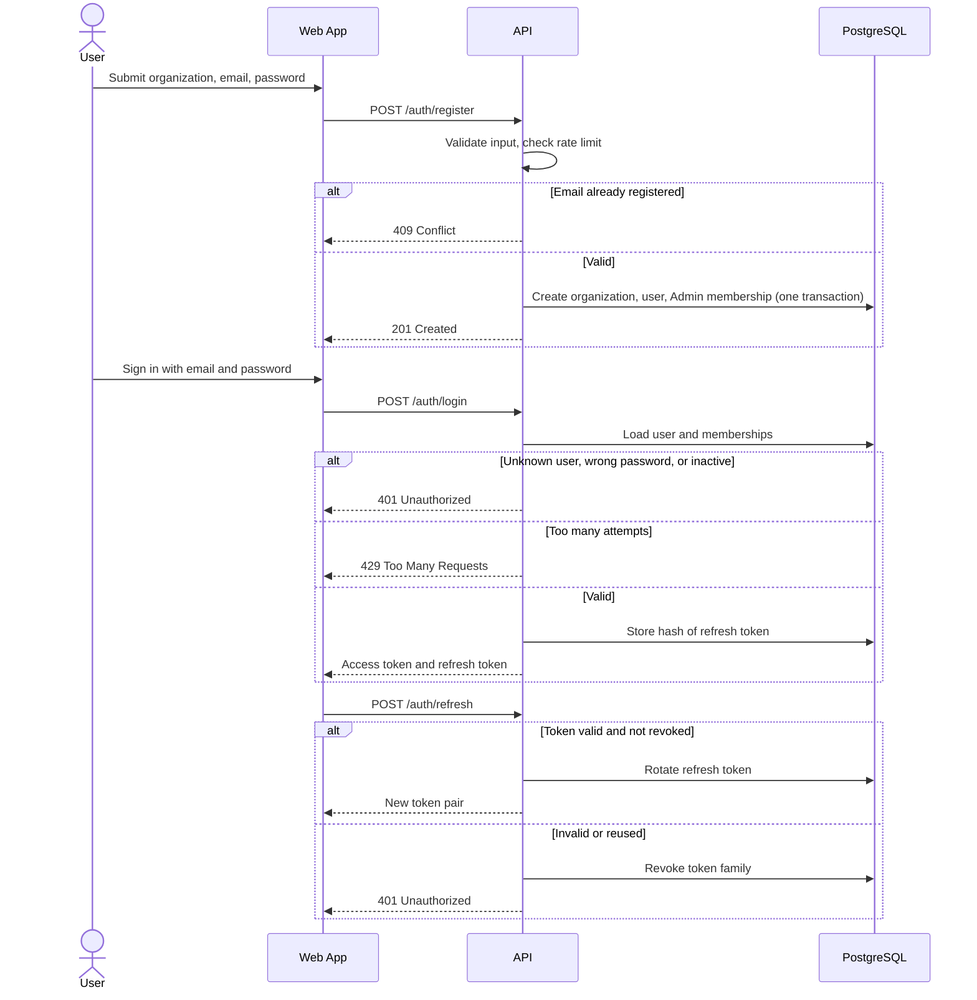
```mermaid
sequenceDiagram
  actor U as User
  participant W as Web App
  participant A as API
  participant DB as PostgreSQL

  U->>W: Submit organization, email, password
  W->>A: POST /auth/register
  A->>A: Validate input, check rate limit
  alt Email already registered
    A-->>W: 409 Conflict
  else Valid
    A->>DB: Create organization, user, Admin membership (one transaction)
    A-->>W: 201 Created
  end

  U->>W: Sign in with email and password
  W->>A: POST /auth/login
  A->>DB: Load user and memberships
  alt Unknown user, wrong password, or inactive
    A-->>W: 401 Unauthorized
  else Too many attempts
    A-->>W: 429 Too Many Requests
  else Valid
    A->>DB: Store hash of refresh token
    A-->>W: Access token and refresh token
  end

  W->>A: POST /auth/refresh
  alt Token valid and not revoked
    A->>DB: Rotate refresh token
    A-->>W: New token pair
  else Invalid or reused
    A->>DB: Revoke token family
    A-->>W: 401 Unauthorized
  end
```

### SD-02: F02 Manage Members and Roles

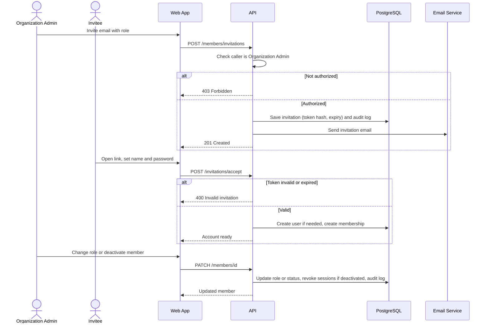
```mermaid
sequenceDiagram
  actor Admin as Organization Admin
  actor Inv as Invitee
  participant W as Web App
  participant A as API
  participant DB as PostgreSQL
  participant M as Email Service

  Admin->>W: Invite email with role
  W->>A: POST /members/invitations
  A->>A: Check caller is Organization Admin
  alt Not authorized
    A-->>W: 403 Forbidden
  else Authorized
    A->>DB: Save invitation (token hash, expiry) and audit log
    A->>M: Send invitation email
    A-->>W: 201 Created
  end

  Inv->>W: Open link, set name and password
  W->>A: POST /invitations/accept
  alt Token invalid or expired
    A-->>W: 400 Invalid invitation
  else Valid
    A->>DB: Create user if needed, create membership
    A-->>W: Account ready
  end

  Admin->>W: Change role or deactivate member
  W->>A: PATCH /members/id
  A->>DB: Update role or status, revoke sessions if deactivated, audit log
  A-->>W: Updated member
```

### SD-03: F03 Manage Collections and Access

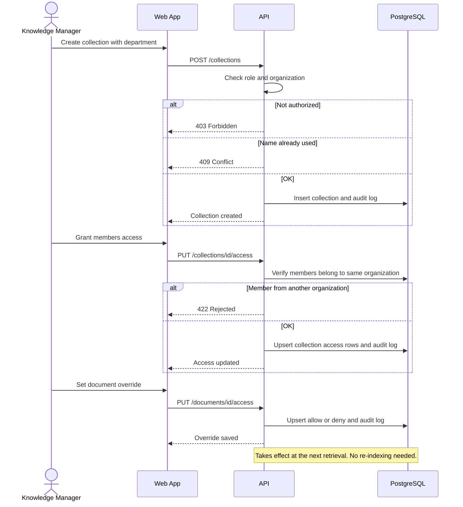
```mermaid
sequenceDiagram
  actor KM as Knowledge Manager
  participant W as Web App
  participant A as API
  participant DB as PostgreSQL

  KM->>W: Create collection with department
  W->>A: POST /collections
  A->>A: Check role and organization
  alt Not authorized
    A-->>W: 403 Forbidden
  else Name already used
    A-->>W: 409 Conflict
  else OK
    A->>DB: Insert collection and audit log
    A-->>W: Collection created
  end

  KM->>W: Grant members access
  W->>A: PUT /collections/id/access
  A->>DB: Verify members belong to same organization
  alt Member from another organization
    A-->>W: 422 Rejected
  else OK
    A->>DB: Upsert collection access rows and audit log
    A-->>W: Access updated
  end

  KM->>W: Set document override
  W->>A: PUT /documents/id/access
  A->>DB: Upsert allow or deny and audit log
  A-->>W: Override saved
  Note over A,DB: Takes effect at the next retrieval. No re-indexing needed.
```

### SD-04: F04 Upload Document

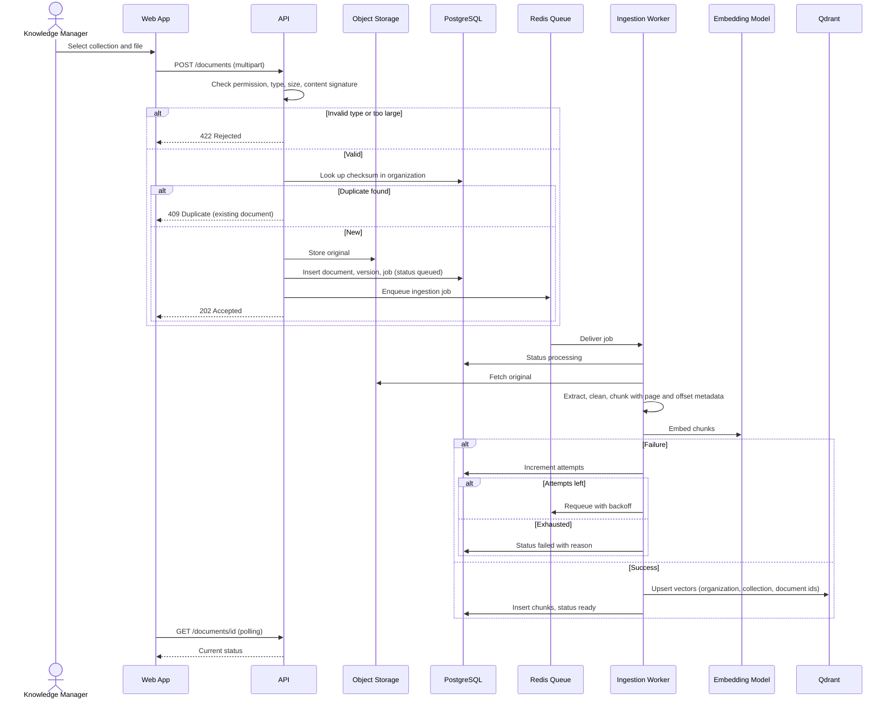
```mermaid
sequenceDiagram
  actor KM as Knowledge Manager
  participant W as Web App
  participant A as API
  participant S3 as Object Storage
  participant DB as PostgreSQL
  participant Q as Redis Queue
  participant WK as Ingestion Worker
  participant E as Embedding Model
  participant V as Qdrant

  KM->>W: Select collection and file
  W->>A: POST /documents (multipart)
  A->>A: Check permission, type, size, content signature
  alt Invalid type or too large
    A-->>W: 422 Rejected
  else Valid
    A->>DB: Look up checksum in organization
    alt Duplicate found
      A-->>W: 409 Duplicate (existing document)
    else New
      A->>S3: Store original
      A->>DB: Insert document, version, job (status queued)
      A->>Q: Enqueue ingestion job
      A-->>W: 202 Accepted
    end
  end

  Q->>WK: Deliver job
  WK->>DB: Status processing
  WK->>S3: Fetch original
  WK->>WK: Extract, clean, chunk with page and offset metadata
  WK->>E: Embed chunks
  alt Failure
    WK->>DB: Increment attempts
    alt Attempts left
      WK->>Q: Requeue with backoff
    else Exhausted
      WK->>DB: Status failed with reason
    end
  else Success
    WK->>V: Upsert vectors (organization, collection, document ids)
    WK->>DB: Insert chunks, status ready
  end

  W->>A: GET /documents/id (polling)
  A-->>W: Current status
```

### SD-05: F05 Manage Documents

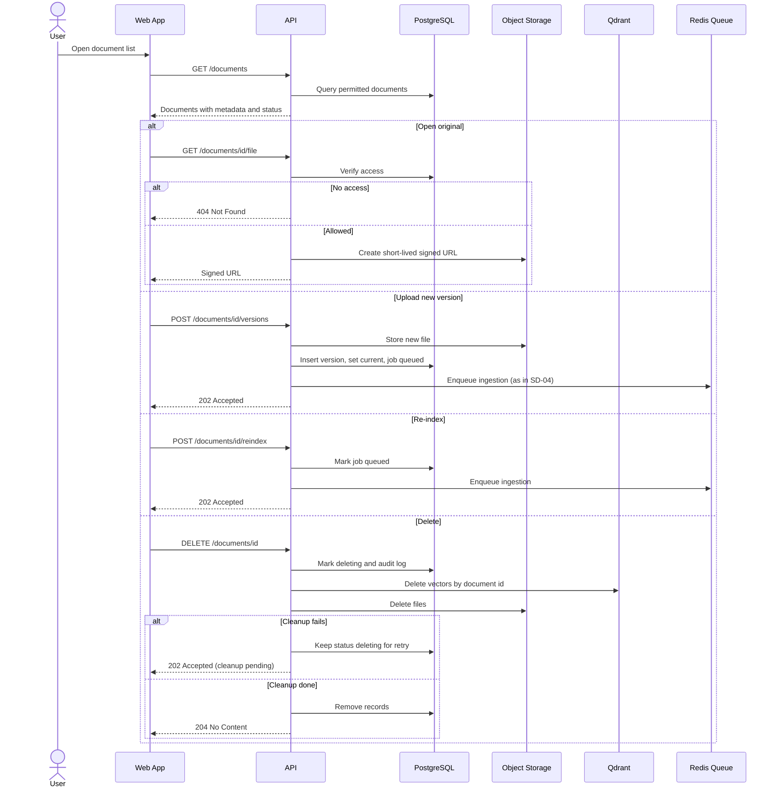
```mermaid
sequenceDiagram
  actor U as User
  participant W as Web App
  participant A as API
  participant DB as PostgreSQL
  participant S3 as Object Storage
  participant V as Qdrant
  participant Q as Redis Queue

  U->>W: Open document list
  W->>A: GET /documents
  A->>DB: Query permitted documents
  A-->>W: Documents with metadata and status

  alt Open original
    W->>A: GET /documents/id/file
    A->>DB: Verify access
    alt No access
      A-->>W: 404 Not Found
    else Allowed
      A->>S3: Create short-lived signed URL
      A-->>W: Signed URL
    end
  else Upload new version
    W->>A: POST /documents/id/versions
    A->>S3: Store new file
    A->>DB: Insert version, set current, job queued
    A->>Q: Enqueue ingestion (as in SD-04)
    A-->>W: 202 Accepted
  else Re-index
    W->>A: POST /documents/id/reindex
    A->>DB: Mark job queued
    A->>Q: Enqueue ingestion
    A-->>W: 202 Accepted
  else Delete
    W->>A: DELETE /documents/id
    A->>DB: Mark deleting and audit log
    A->>V: Delete vectors by document id
    A->>S3: Delete files
    alt Cleanup fails
      A->>DB: Keep status deleting for retry
      A-->>W: 202 Accepted (cleanup pending)
    else Cleanup done
      A->>DB: Remove records
      A-->>W: 204 No Content
    end
  end
```

### SD-06: F06 Search Knowledge

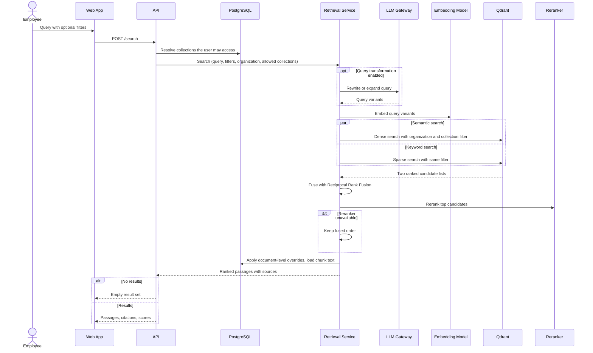
```mermaid
sequenceDiagram
  actor U as Employee
  participant W as Web App
  participant A as API
  participant DB as PostgreSQL
  participant R as Retrieval Service
  participant L as LLM Gateway
  participant E as Embedding Model
  participant V as Qdrant
  participant RR as Reranker

  U->>W: Query with optional filters
  W->>A: POST /search
  A->>DB: Resolve collections the user may access
  A->>R: Search (query, filters, organization, allowed collections)
  opt Query transformation enabled
    R->>L: Rewrite or expand query
    L-->>R: Query variants
  end
  R->>E: Embed query variants
  par Semantic search
    R->>V: Dense search with organization and collection filter
  and Keyword search
    R->>V: Sparse search with same filter
  end
  V-->>R: Two ranked candidate lists
  R->>R: Fuse with Reciprocal Rank Fusion
  R->>RR: Rerank top candidates
  alt Reranker unavailable
    R->>R: Keep fused order
  end
  R->>DB: Apply document-level overrides, load chunk text
  R-->>A: Ranked passages with sources
  alt No results
    A-->>W: Empty result set
  else Results
    A-->>W: Passages, citations, scores
  end
```

### SD-07: F07 Chat with Knowledge Assistant

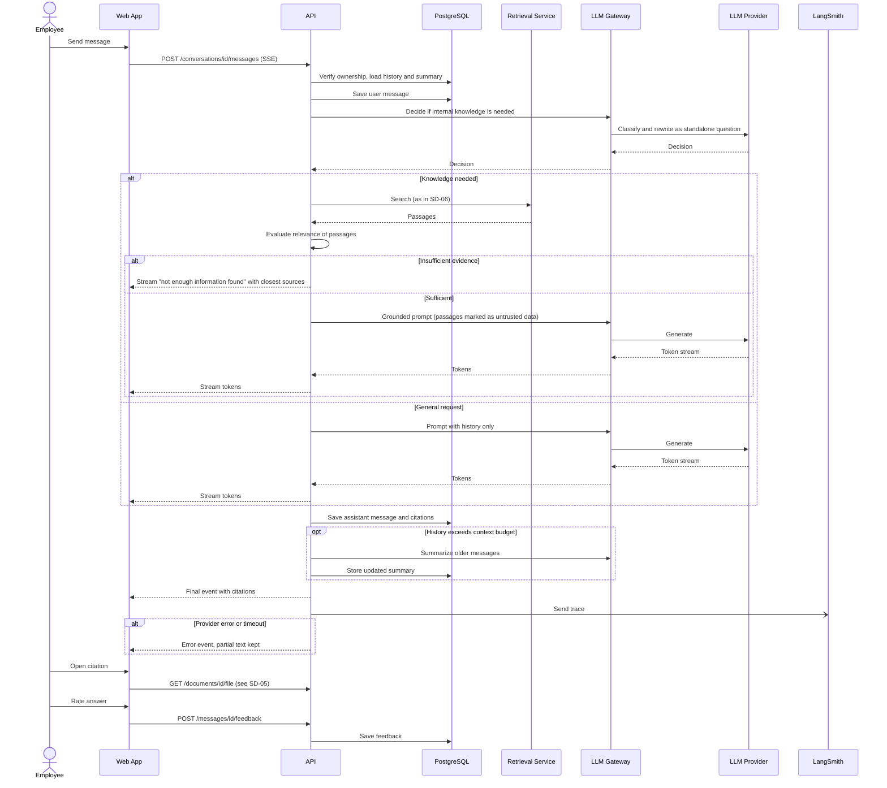
```mermaid
sequenceDiagram
  actor U as Employee
  participant W as Web App
  participant A as API
  participant DB as PostgreSQL
  participant R as Retrieval Service
  participant L as LLM Gateway
  participant M as LLM Provider
  participant LS as LangSmith

  U->>W: Send message
  W->>A: POST /conversations/id/messages (SSE)
  A->>DB: Verify ownership, load history and summary
  A->>DB: Save user message
  A->>L: Decide if internal knowledge is needed
  L->>M: Classify and rewrite as standalone question
  M-->>L: Decision
  L-->>A: Decision
  alt Knowledge needed
    A->>R: Search (as in SD-06)
    R-->>A: Passages
    A->>A: Evaluate relevance of passages
    alt Insufficient evidence
      A-->>W: Stream "not enough information found" with closest sources
    else Sufficient
      A->>L: Grounded prompt (passages marked as untrusted data)
      L->>M: Generate
      M-->>L: Token stream
      L-->>A: Tokens
      A-->>W: Stream tokens
    end
  else General request
    A->>L: Prompt with history only
    L->>M: Generate
    M-->>L: Token stream
    L-->>A: Tokens
    A-->>W: Stream tokens
  end
  A->>DB: Save assistant message and citations
  opt History exceeds context budget
    A->>L: Summarize older messages
    A->>DB: Store updated summary
  end
  A-->>W: Final event with citations
  A-)LS: Send trace
  alt Provider error or timeout
    A-->>W: Error event, partial text kept
  end

  U->>W: Open citation
  W->>A: GET /documents/id/file (see SD-05)
  U->>W: Rate answer
  W->>A: POST /messages/id/feedback
  A->>DB: Save feedback
```

### SD-08: F08 Run Agentic Task

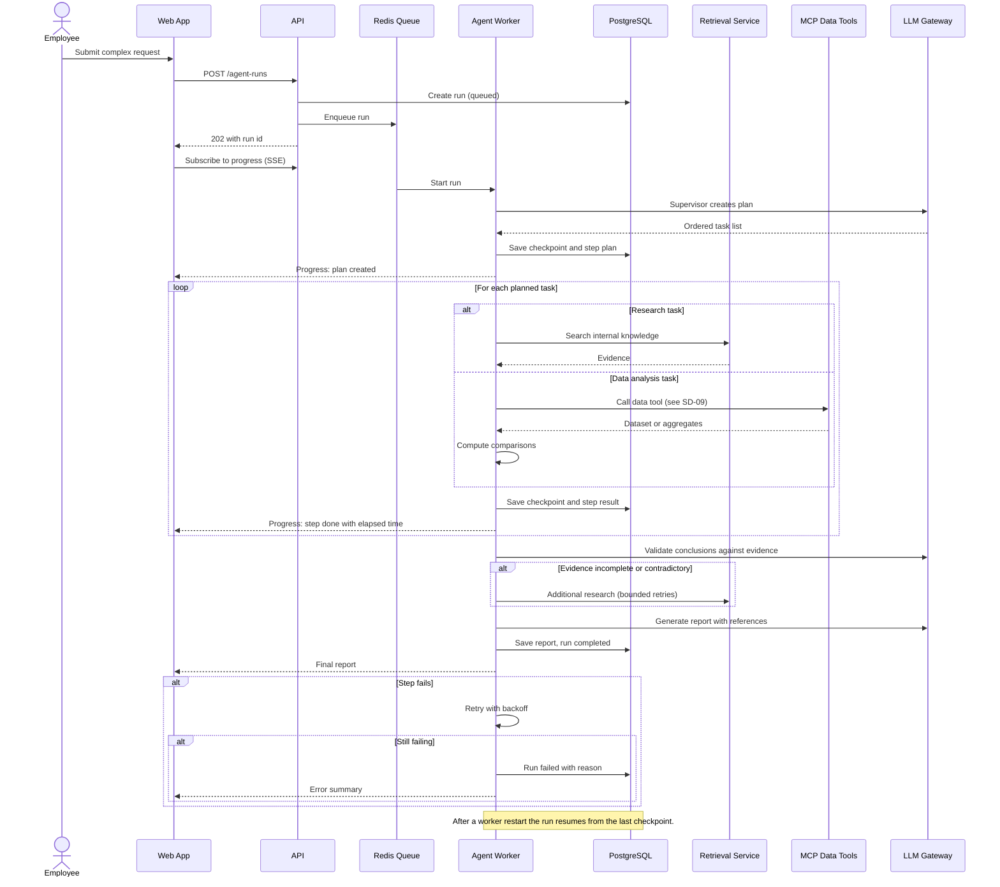
```mermaid
sequenceDiagram
  actor U as Employee
  participant W as Web App
  participant A as API
  participant Q as Redis Queue
  participant G as Agent Worker
  participant DB as PostgreSQL
  participant R as Retrieval Service
  participant MC as MCP Data Tools
  participant L as LLM Gateway

  U->>W: Submit complex request
  W->>A: POST /agent-runs
  A->>DB: Create run (queued)
  A->>Q: Enqueue run
  A-->>W: 202 with run id
  W->>A: Subscribe to progress (SSE)

  Q->>G: Start run
  G->>L: Supervisor creates plan
  L-->>G: Ordered task list
  G->>DB: Save checkpoint and step plan
  G-->>W: Progress: plan created

  loop For each planned task
    alt Research task
      G->>R: Search internal knowledge
      R-->>G: Evidence
    else Data analysis task
      G->>MC: Call data tool (see SD-09)
      MC-->>G: Dataset or aggregates
      G->>G: Compute comparisons
    end
    G->>DB: Save checkpoint and step result
    G-->>W: Progress: step done with elapsed time
  end

  G->>L: Validate conclusions against evidence
  alt Evidence incomplete or contradictory
    G->>R: Additional research (bounded retries)
  end
  G->>L: Generate report with references
  G->>DB: Save report, run completed
  G-->>W: Final report

  alt Step fails
    G->>G: Retry with backoff
    alt Still failing
      G->>DB: Run failed with reason
      G-->>W: Error summary
    end
  end
  Note over G,DB: After a worker restart the run resumes from the last checkpoint.
```

### SD-09: F09 Use Business Tools via MCP

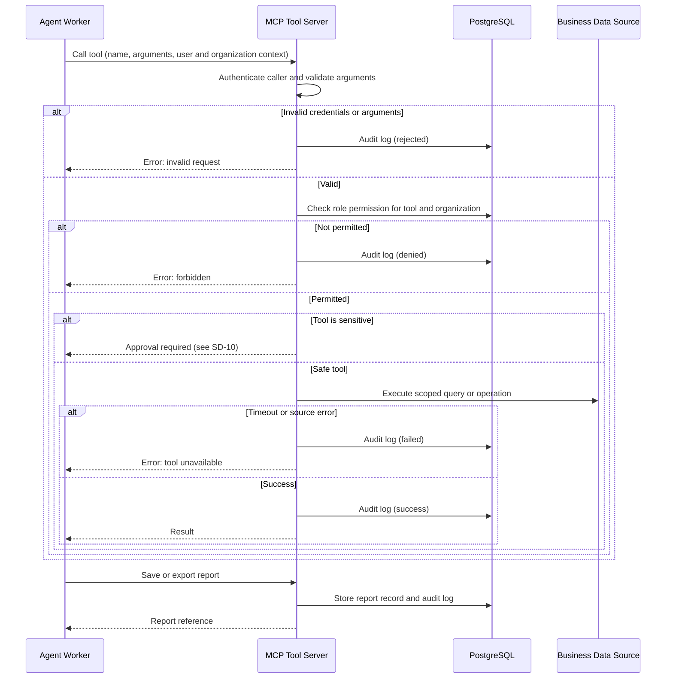
```mermaid
sequenceDiagram
  participant G as Agent Worker
  participant S as MCP Tool Server
  participant DB as PostgreSQL
  participant B as Business Data Source

  G->>S: Call tool (name, arguments, user and organization context)
  S->>S: Authenticate caller and validate arguments
  alt Invalid credentials or arguments
    S->>DB: Audit log (rejected)
    S-->>G: Error: invalid request
  else Valid
    S->>DB: Check role permission for tool and organization
    alt Not permitted
      S->>DB: Audit log (denied)
      S-->>G: Error: forbidden
    else Permitted
      alt Tool is sensitive
        S-->>G: Approval required (see SD-10)
      else Safe tool
        S->>B: Execute scoped query or operation
        alt Timeout or source error
          S->>DB: Audit log (failed)
          S-->>G: Error: tool unavailable
        else Success
          S->>DB: Audit log (success)
          S-->>G: Result
        end
      end
    end
  end

  G->>S: Save or export report
  S->>DB: Store report record and audit log
  S-->>G: Report reference
```

### SD-10: F10 Approve Sensitive Action

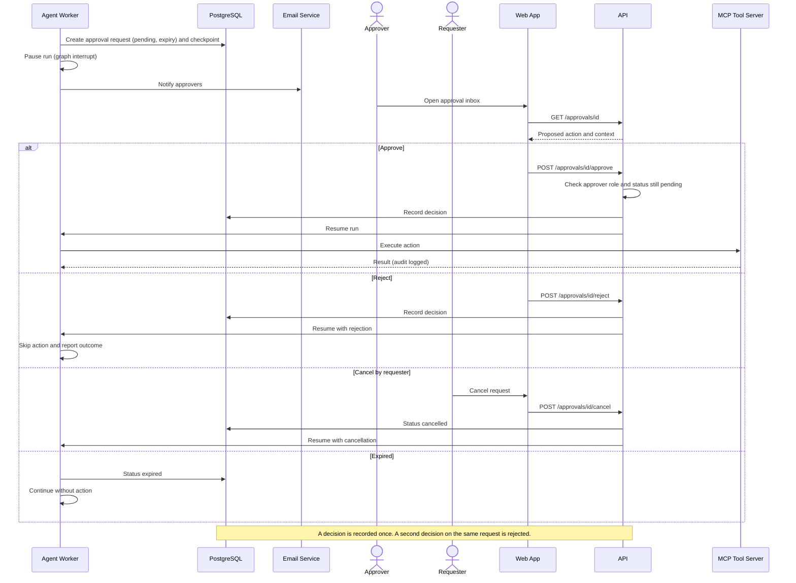
```mermaid
sequenceDiagram
  participant G as Agent Worker
  participant DB as PostgreSQL
  participant M as Email Service
  actor Ap as Approver
  actor Rq as Requester
  participant W as Web App
  participant A as API
  participant S as MCP Tool Server

  G->>DB: Create approval request (pending, expiry) and checkpoint
  G->>G: Pause run (graph interrupt)
  G->>M: Notify approvers
  Ap->>W: Open approval inbox
  W->>A: GET /approvals/id
  A-->>W: Proposed action and context

  alt Approve
    W->>A: POST /approvals/id/approve
    A->>A: Check approver role and status still pending
    A->>DB: Record decision
    A->>G: Resume run
    G->>S: Execute action
    S-->>G: Result (audit logged)
  else Reject
    W->>A: POST /approvals/id/reject
    A->>DB: Record decision
    A->>G: Resume with rejection
    G->>G: Skip action and report outcome
  else Cancel by requester
    Rq->>W: Cancel request
    W->>A: POST /approvals/id/cancel
    A->>DB: Status cancelled
    A->>G: Resume with cancellation
  else Expired
    G->>DB: Status expired
    G->>G: Continue without action
  end
  Note over A,DB: A decision is recorded once. A second decision on the same request is rejected.
```

### SD-11: F11 Monitor AI and Platform Health

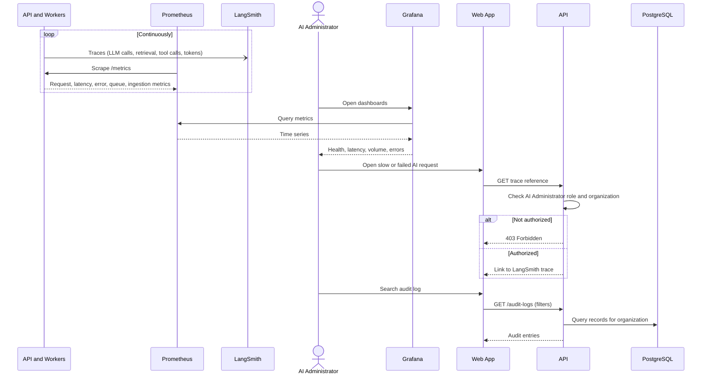
```mermaid
sequenceDiagram
  participant S as API and Workers
  participant P as Prometheus
  participant LS as LangSmith
  actor AIA as AI Administrator
  participant GR as Grafana
  participant W as Web App
  participant A as API
  participant DB as PostgreSQL

  loop Continuously
    S-)LS: Traces (LLM calls, retrieval, tool calls, tokens)
    P->>S: Scrape /metrics
    S-->>P: Request, latency, error, queue, ingestion metrics
  end

  AIA->>GR: Open dashboards
  GR->>P: Query metrics
  P-->>GR: Time series
  GR-->>AIA: Health, latency, volume, errors

  AIA->>W: Open slow or failed AI request
  W->>A: GET trace reference
  A->>A: Check AI Administrator role and organization
  alt Not authorized
    A-->>W: 403 Forbidden
  else Authorized
    A-->>W: Link to LangSmith trace
  end

  AIA->>W: Search audit log
  W->>A: GET /audit-logs (filters)
  A->>DB: Query records for organization
  A-->>W: Audit entries
```

### SD-12: F12 Evaluate Retrieval and Answer Quality

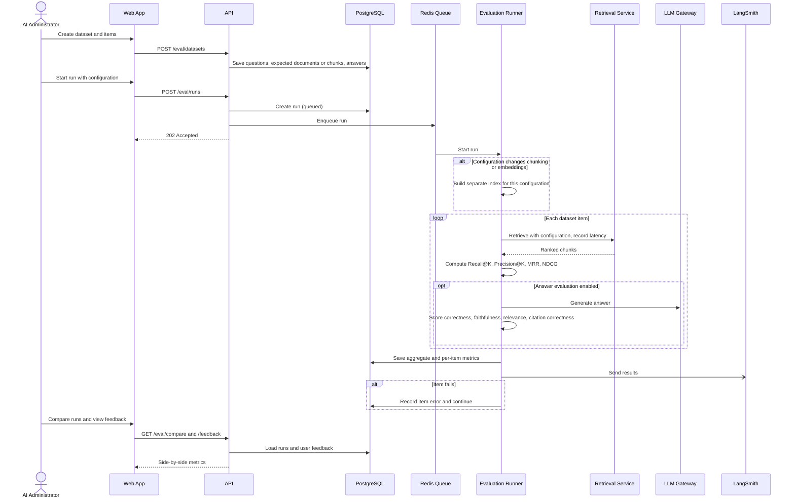
```mermaid
sequenceDiagram
  actor AIA as AI Administrator
  participant W as Web App
  participant A as API
  participant DB as PostgreSQL
  participant Q as Redis Queue
  participant EV as Evaluation Runner
  participant R as Retrieval Service
  participant L as LLM Gateway
  participant LS as LangSmith

  AIA->>W: Create dataset and items
  W->>A: POST /eval/datasets
  A->>DB: Save questions, expected documents or chunks, answers
  AIA->>W: Start run with configuration
  W->>A: POST /eval/runs
  A->>DB: Create run (queued)
  A->>Q: Enqueue run
  A-->>W: 202 Accepted

  Q->>EV: Start run
  alt Configuration changes chunking or embeddings
    EV->>EV: Build separate index for this configuration
  end
  loop Each dataset item
    EV->>R: Retrieve with configuration, record latency
    R-->>EV: Ranked chunks
    EV->>EV: Compute Recall@K, Precision@K, MRR, NDCG
    opt Answer evaluation enabled
      EV->>L: Generate answer
      EV->>EV: Score correctness, faithfulness, relevance, citation correctness
    end
  end
  EV->>DB: Save aggregate and per-item metrics
  EV-)LS: Send results
  alt Item fails
    EV->>DB: Record item error and continue
  end

  AIA->>W: Compare runs and view feedback
  W->>A: GET /eval/compare and /feedback
  A->>DB: Load runs and user feedback
  A-->>W: Side-by-side metrics
```
